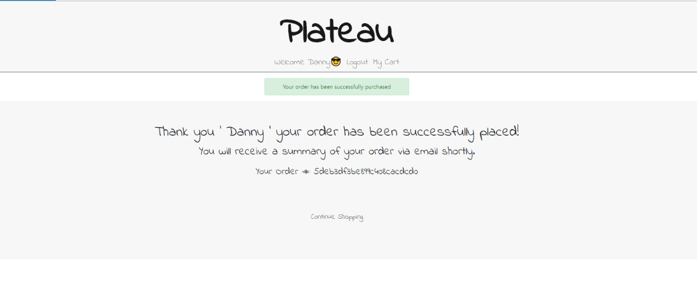

# PLATEAU 1.0.0

Plateau is an e-ccommerce, fully-responsive and full-stack application built with MERN (Mongo, Express, React/Redux, Node.js) stacks for purpose of:

- Learning React/Redux
- Writing efficient and re-usable back-end APIs using Node.js
- Making API calls to access data from the database to the client-side page using Axios
- Mananging application states to be mapped to multiple container components

## DESCRIPTION

Users first have to register/login and add items from different categories. Then, users may edit quanity/items in My Cart page and complete their orders after entering home address and credit card information. An order complete email will be sent to user's given email address.

## QUICK START

```
# Create default.json file in config folder
# This file must be located in config/default.json
# Add jwtSecret and URI of your mongodb connection (either in your local machine or from mongo atlas). For example:

{
    "mongoURI": "mongodb://localhost/test",
    "jwtSecret": "twt-token-secret"
}
```

```
# Install Server Dependencies
npm install

# Install Client Dependencies
cd client
npm install

# Run both Express & React from root
npm run dev

# Build for production
cd client
npm run build
```

## FINAL PRODUCT





## DEPENDENCIES

- React
- Redux
- MongoDB
- Mongoose
- Node
- Json Web Token
- Nodemon
- Express-validator
- uuid
- Slick Carousel
- Config
- Concurrently
- Bcrypitjs

### Author

Danny Rhee

### Version

1.0.0
